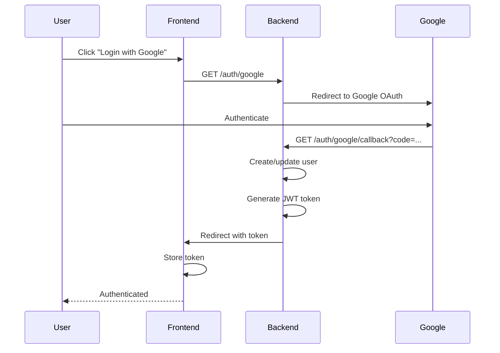
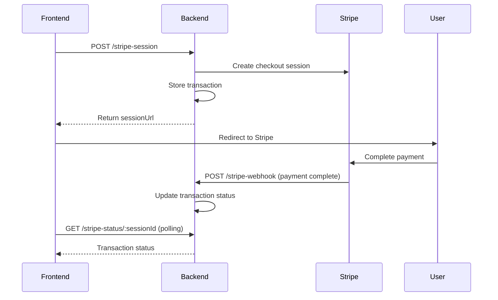
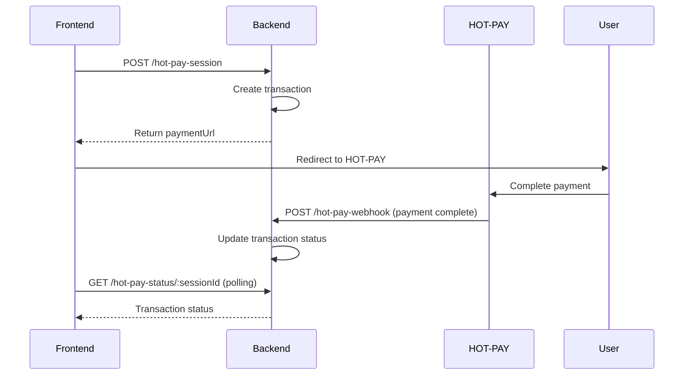

# E-Commerce Payment Gateway - PoC

A Node.js backend service demonstrating dual payment integration with Stripe and NEAR via HOT-PAY payment methods. Features secure Google OAuth 2.0 authentication.

**[Live Demo](https://onechocolate.netlify.app/)** - Try it out!

## Installation

```bash
npm install
# or
yarn install
```

## Environment Variables

Create a `.env` file with the following:

```env
PORT=3000
STRIPE_SECRET_KEY=your_stripe_secret_key
STRIPE_WEBHOOK_SECRET=your_stripe_webhook_secret
GOOGLE_CLIENT_ID=your_google_client_id
GOOGLE_CLIENT_SECRET=your_google_client_secret
GOOGLE_REDIRECT_URI=http://localhost:3000/auth/google/callback
JWT_SECRET=your_jwt_secret
FRONTEND_URL=http://localhost:5173
```

## Running the Application

```bash
# Development
npm run dev

# Build
npm run build

# Production
npm start
```

## Authentication Flow

**Flow:**

1. User clicks "Login with Google"
2. Frontend redirects to `GET /auth/google`
3. User authenticates with Google
4. Google redirects to `GET /auth/google/callback`
5. Backend creates/updates user in database
6. Backend generates JWT token
7. Backend redirects to frontend with token
8. Frontend stores token and uses it for authenticated requests

**Diagram:**



## Payment Flow

### Stripe Payment

**Flow:**

1. Frontend calls `POST /stripe-session` with product details
2. Backend creates Stripe checkout session and stores transaction
3. User completes payment on Stripe
4. Stripe sends webhook to `POST /stripe-webhook`
5. Backend updates transaction status
6. Frontend polls `GET /stripe-status/:sessionId` to check status

**Testing Stripe Webhooks:**

To test Stripe webhooks in development, run the Stripe CLI to forward webhook events to your backend:

```bash
# Local development
stripe listen --forward-to http://localhost:3000/stripe-webhook
# Staging environment
stripe listen --forward-to https://bk-production-8603.up.railway.app/stripe-webhook
```

**Diagram:**



### Crypto Payment

> **Note:** When the backend generates the payment URL, it creates a UUID as `transaction_id` and sends it to the frontend as a query parameter in the payment URL. This allows the frontend to track the transaction.

**Flow:**

1. Frontend calls `POST /hot-pay-session` with product details
2. Backend creates transaction with UUID and returns payment URL (includes `transaction_id` as query param)
3. User completes payment via HOT-PAY
4. HOT-PAY sends webhook to `POST /hot-pay-webhook`
5. Backend updates transaction status
6. Frontend polls `GET /hot-pay-status/:sessionId` to check status

**Diagram:**



## How to Get API Token for HOT-PAY

Go to [HOT-PAY Admin](https://pay.hot-labs.org/admin/api-keys) to generate an API key.

## API Endpoints

### Public Endpoints (No Authentication Required)

#### `GET /health`

Health check endpoint.

```json
// Response
{
  "status": "ok"
}
```

#### `GET /auth/google`

Initiates Google OAuth flow. Redirects to Google login.

#### `GET /auth/google/callback?code=...`

Handles Google OAuth callback and redirects to frontend with JWT token.

#### `POST /stripe-webhook`

Stripe webhook for payment events (verified with Stripe signature).

- Events: `checkout.session.completed`, `checkout.session.expired`

#### `POST /hot-pay-webhook`

HOT-PAY cryptocurrency payment webhook.

```json
// Body
{
  "type": "PAYMENT_STATUS_UPDATE",
  "status": "SUCCESS",
  "memo": "transaction-id",
  "near_trx": "near-transaction-hash"
}
```

#### `GET /refresh-database`

**WARNING: This endpoint will reset the entire database.**

```json
// Response
{
  "message": "Database refreshed successfully"
}
```

### Protected Endpoints (JWT Required)

#### `GET /auth/me`

Get current authenticated user information.

```json
// Response
{
  "user": {
    "userId": 1,
    "email": "user@example.com",
    "name": "John Doe"
  }
}
```

#### `POST /stripe-session`

Create a Stripe checkout session.

```json
// Body
{
  "email": "user@example.com",
  "productName": "Product Name",
  "amount": 1000
}

// Response
{
  "sessionUrl": "https://checkout.stripe.com/...",
  "sessionId": "cs_test_..."
}
```

#### `GET /stripe-status/:sessionId`

Get Stripe transaction status.

```json
// Response
{
  "status": "completed",
  "transaction": {
    "id": 1,
    "email": "user@example.com",
    "status": "completed",
    "amount_cents": 1000,
    "product_name": "Product Name",
    "created_at": "2024-01-01T00:00:00.000Z"
  }
}
```

#### `GET /stripe-transactions`

Get all Stripe transactions.

```json
// Response
{
  "transactions": [...]
}
```

#### `POST /hot-pay-session`

Create a HOT-PAY cryptocurrency payment session.

```json
// Body
{
  "email": "user@example.com",
  "productName": "Product Name",
  "amount": 1000
}

// Response
{
  "paymentUrl": "https://pay.hot-labs.org/payment?...",
  "sessionId": "uuid-here"
}
```

#### `GET /hot-pay-status/:sessionId`

Get HOT-PAY transaction status.

```json
// Response
{
  "status": "completed",
  "transaction": {
    "id": 1,
    "email": "user@example.com",
    "status": "completed",
    "amount_cents": 1000,
    "product_name": "Product Name",
    "near_transaction_hash": "..."
  }
}
```

#### `GET /hot-pay-transactions`

Get all HOT-PAY transactions.

```json
// Response
{
  "transactions": [...]
}
```

#### `POST /products`

Create a new product.

```json
// Body
{
  "name": "Product Name",
  "price": 1000,
  "description": "Product description"
}

// Response
{
  "id": 1,
  "name": "Product Name",
  "price": 1000,
  "description": "Product description"
}
```

#### `GET /products`

Get all products.

```json
// Response
{
  "products": [...]
}
```

## License

MIT
